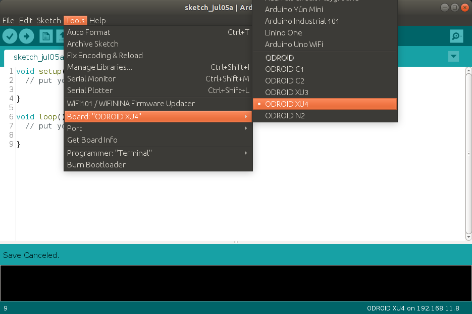
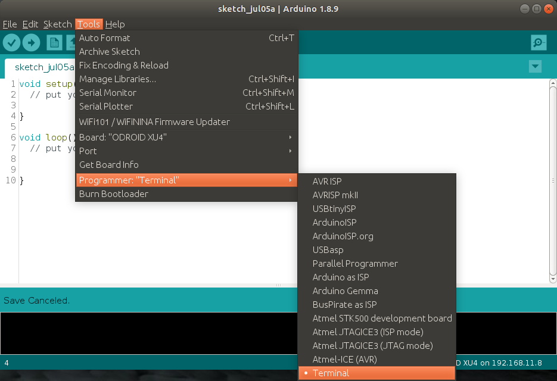

# Oduino

Arduino core for the ODROID

## Installation

### OS

Supports Ubuntu MATE desktop.

Installation Guide and OS download link: <a href="https://wiki.odroid.com/getting_started/os_installation_guide" target=_blank>https://wiki.odroid.com/getting_started/os_installation_guide</a>

### Arduino

  - Download latest Arduino IDE for the Linux ARM from <a href="https://www.arduino.cc/en/Main/Software" target=_blank>https://www.arduino.cc/en/Main/Software</a>
    - ODROID C1/XU4 : ARM 32bit
    - ODROID C2/N2 : ARM 64bit
  - Installation Guide : <a href="https://www.arduino.cc/en/Guide/Linux" target=_blank>https://www.arduino.cc/en/Guide/Linux</a>

### Oduino

Open Terminal and execute the following command (copy and paste the following command to the termianl):

```bash
sudo add-apt-repository -y ppa:hardkernel/ppa &&
sudo apt update
```

```bash
sudo apt install -y build-essential git odroid-config \
    odroid-wiringpi libwiringpi-dev
```

```bash
git clone https://github.com/hhk7734/oduino.git ~/Arduino/hardware/hardkernel/odroid
```

If you already opened the Arduino IDE, Close and reopen the Arduino IDE.

## Setup

### Selecting board



### Selecting programmer



## Setup NOPASSWD

If you don't want to input your password when uploading, register the user as the no-password user on the end of the sudoers file.

```bash
sudo visudo
```

```bash
...
odroid ALL=(ALL) NOPASSWD: ALL
```
